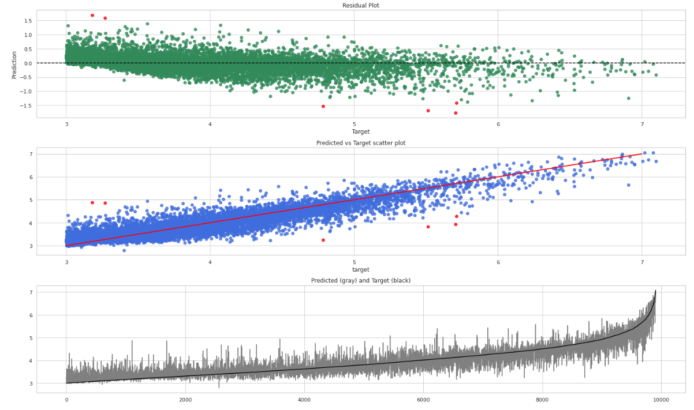
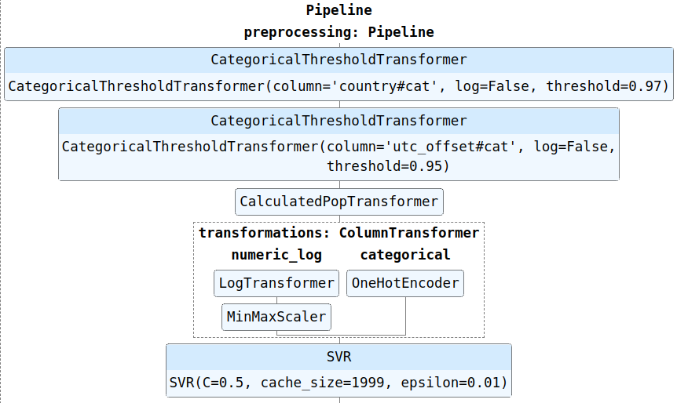

<h1>DBpedia's cities population prediction</h1>
<h5>The challenge and some ideas were taken from this book <a href="https://www.amazon.com/Art-Feature-Engineering-Essentials-Learning/dp/1108709389">The Art of Feature Engineering</a></h5>

<h3>Challenge:</h3>
   * Given <a href="https://wiki.dbpedia.org/" >DBpedia 2020 files</a> predict population of all cities (excluding cities with less than 1000 people)
   
<h3>Explanation:</h3>
   
DBpedia files are distributed as files of triples, where a triple consists of:
 * `subject` which is always an entity in the ontology: <a href="https://en.wikipedia.org/wiki/Argentina">Argentina</a>, <a href="https://en.wikipedia.org/wiki/Basketball">Basketball</a>, etc
 * `verb` (or relation) which is an ontological relation: For basketball we have <b>Team members, Venue, Type</b>. For Argentina we have <b> Capital, Religion, Area, etc </b>
 * `object` which can be either another entity <b>(Buenos Aires, FIBA, Basketball)</b> or a literal value (numbers or strings). 
  
We have 3 files to merge:
  1) File with all the entities 
  2) One with all the relations of entities with other entities (Argentina -> **Capital** -> Buenos Aires)
  3) and a final one with relations of entities with literal values (Basketball -> **Team members** -> 5)
      
To really identify "cities or settlements with at least 1,000 people", we read a file also distributed by DBpedia: geonames_links.ttl.bz2 (see <a href="https://public.opendatasoft.com/explore/dataset/geonames-all-cities-with-a-population-1000/table/?disjunctive.country"> GeoNames project</a>)
<h3>Approach:</h3>
* **Preprocessing**: (More detailed explanation can be found on preprocessing.ipynb and preprocessing.py) 
    * Filter and Merge the 4 files discussed above
    * Parse the data
    * Identify population verbs/relations to generate target values. Discard any subject without population (we also do some scrapping to wikipedia.com to see if we can find the missing populations)
    * Split populations in two files (training and hold_out) with stratification because the dataset is skewed to the right (see EDA) 
    * Create raw dbpedia dataset, removing relations with very few occurrences (5%) in total and all relations about population (like _PopulationRural_) to avoid data leakage
    * Create training dataframe (look at preprocessing.ipynb to see how and why the columns were added to the final dataframe)
    * Fix population errors found either during EDA or training
    
* **Training**: (See models.py, svr_model.ipynb and linear_model.ipynb)
  - Since the range of the target value goes from 1000 to 21,571,281 I decided to use RMSLE as a metric, to avoid putting more attention to largest values. 
  - All training/test and CV are done with stratification
  - At the moment, the models used are **SVR** and a **second order Polinomial regressor with L2 regularization (Ridge)**
  - Baseline training score using the mean: 
    - 0.7 RMSLE
  - Ridge (polinomial 2° order) training score: 
    - Validation RMSLE: 0.3104
    - Validation R2 score: 0.8046
    - Train RMSLE: 0.2923
    - Train R2 score: 0.8256
  - SVR (with kernel rbf):
    - Validation RMSLE: 0.2796
    - Train RMSLE: 0.2553
  - For EDA see: EDA.ipynb
  
* **Prediction:** (See evaluation.ipynb)
  - I first run a Polinomial regression capable of detect some anomalies (the same used to find them during training)
  - Then I run a script to scrap wikipedia.com and try to find the population of the subjects with anomalies
  - I manualy check and fix the errors found and run the 2 models
  - Baseline held out score using the mean: 
    - 0.7 RMSLE
  - Ridge (polinomial 2° order) training score: 
    - Held out RMSLE: 0.3020
    - Held out R2 score: 0.8128
  - SVR (with kernel rbf):
    - Validation RMSLE: 0.2767
  
* **Problems and limitations:**
  - There are a lot of missing values because each subject has its own set of relations (MOSTRAR )
  - There are a good amount of errors in dbpedia, so manual interaction is needed. (I have to surf the web a lot to check the real populations of some cities when doing error analysis)
  - Not only the target value has errors, but also the other relations like AreaTotal. See linear_model.ipynb. The polinomial model found it.
  - The range of the target value is so big that it would be better to try this as a classification problem (10^3, 10^4, 10^5, 10^6, +10^7)  

* **Further improvements**:
  - Try Random Forest, XGB and NN
  - Try Ensemble learning
  - Treat this a as a classification problem, and try training specialized regression models 

### Prediction vs target plot for a model always predicting the mean value (Log10)

### Plots for the best model so far (Log10) 

### Current pipeline for SVR (see svr_model.ipynb and models.py):

