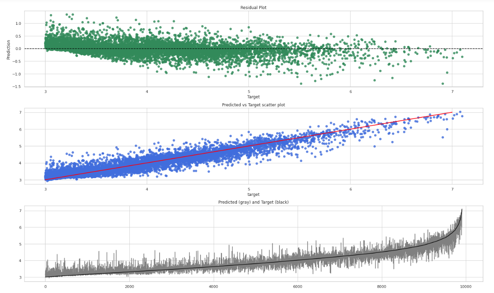

<h1>DBpedia's cities population prediction</h1>
<h5>The challenge and some ideas were taken from this book <a href="https://www.amazon.com/Art-Feature-Engineering-Essentials-Learning/dp/1108709389">The Art of Feature Engineering</a></h5>

<h3>Challenge:</h3>

  * Given <a href="https://wiki.dbpedia.org/" >DBpedia 2020 files</a> predict population of all cities (excluding cities with less than 1000 people)
  * To see how I handle this task using just some description text go to [NLP](nlp/README.MD)
  * To see the evaluation notebook where the prediction of held out set is done and the predictions from NLP are added as features to LGBM, go to [Evaluation.ipynb](evaluation.ipynb)

<h3>Explanation:</h3>
   
DBpedia files are distributed as files of triples, where a triple consists of:
 * `subject` which is always an entity in the ontology: <a href="https://en.wikipedia.org/wiki/Argentina">Argentina</a>, <a href="https://en.wikipedia.org/wiki/Basketball">Basketball</a>, etc
 * `verb` (or relation) which is an ontological relation: For basketball we have <b>Team members, Venue, Type</b>. For Argentina we have <b> Capital, Religion, Area, etc </b>
 * `object` which can be either another entity <b>(Buenos Aires, FIBA, Basketball)</b> or a literal value (numbers or strings). 
  

<h3>Approach:</h3>

* **Prediction:** (See [evaluation notebook](evaluation.ipynb))
  - Since the <b>range of the target values go from 1000 to 21,571,281 </b> I decided to use RMSLE as a metric, to avoid putting more attention to largest values. 
  - I first run a Polinomial regression capable of detect some anomalies (the same used to find them during training)
  - Then I run a script to scrap wikipedia.com and try to find the **real** population of the subjects with anomalies (there are some errors in dbPedia)
  - I manualy check and fix the errors found and run the 2 models
  - The baseline score using the mean is: <b>0.7 RMSLE</b>
  - The best model using infobox features + NLP features gives:
    - **RMSLE: 0.227**
    - Biggest logarithmic error: <b>1.38</b> 
    - Log absolute errors: 
      - Greater than 1: <b>0.38%</b>
      - Greater than 0.5: <b>4.63%</b>
      - Greater than 0.25: <b>19.35%</b>
      - Greater than 0.1: <b>48.87%</b>
  - I also split the target in 8 sensible bins and I got a <b>Quadratic Kappa score of 0.93 </b>. As you'll see, most of the corner values in the confusion matrix are 0, which means the model doesn't make big mistakes (ie: saying one city has 2500 people when it has 50,000)
    
* **Preprocessing**: (A more detailed explanation can be found on [preprocessing.ipynb](preprocessing.ipynb) and preprocessing.py) 
    * We have 4 files to merge:
      1) File with all the entities 
      2) One with all the relations of entities with other entities (Argentina -> **Capital** -> Buenos Aires)
      3) and a final one with relations of entities with literal values (Basketball -> **Team members** -> 5)
      4) To really identify "cities or settlements with at least 1,000 people", we read a file also distributed by DBpedia: geonames_links.ttl.bz2 (see <a href="https://public.opendatasoft.com/explore/dataset/geonames-all-cities-with-a-population-1000/table/?disjunctive.country"> GeoNames project</a>)
    * Filter and Merge the 4 files discussed above
    * Parse the data
    * Identify population verbs/relations to generate target values. Discard any subject without population (we also do some scrapping to wikipedia.com to see if we can find the missing populations)
    * Split populations in two files (training and held_out) with stratification because the dataset is skewed to the right (see [EDA.ipynb](EDA.ipynb))
    * Create raw dbpedia dataset, removing relations with very few occurrences (5%) in total and all relations about population (like _PopulationRural_) to avoid data leakage
    * Create training dataframe (look at preprocessing.ipynb to see how and why the columns were added to the final dataframe)
    * Fix population errors found either during EDA or training
    
* **Training**: (See also models.py)
  - All training/test are done with stratification and CV
  - At the moment, the models used are:
    - [Ridge polinomial of 2° order](linear_model.ipynb)
    - [Non linear SVR](svr_model.ipynb)
    - [LGBM](lxgb_model.ipynb)
    - [NLP using 8 bins and just description text](nlp/NLP_evaluation.ipynb):
  - To see EDA go to [EDA.ipynb](EDA.ipynb)
  
* **Problems and limitations:**
  - There are a lot of missing values because each subject has its own set of relations
  - There are a good amount of errors in dbpedia, so manual interaction is needed. (I have to surf the web a lot to check the real populations of some cities when doing error analysis)
  - Not only the target value has errors, but also the other relations like AreaTotal.

* **Further improvements**:
  - More error analysis over biggest differences
  - Feature importance
   

### Prediction vs target plot for a model always predicting the mean value (Log10)

### Plots for the best model so far: LGBM + NLP (Log10) 

### Target split in 8 sensible bins gives a Quadratic kappa score of 0.93

### Errors Boxplot

