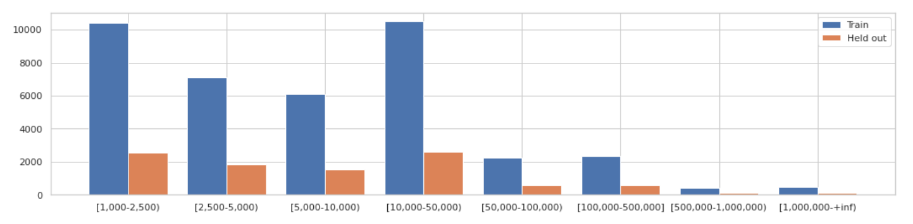
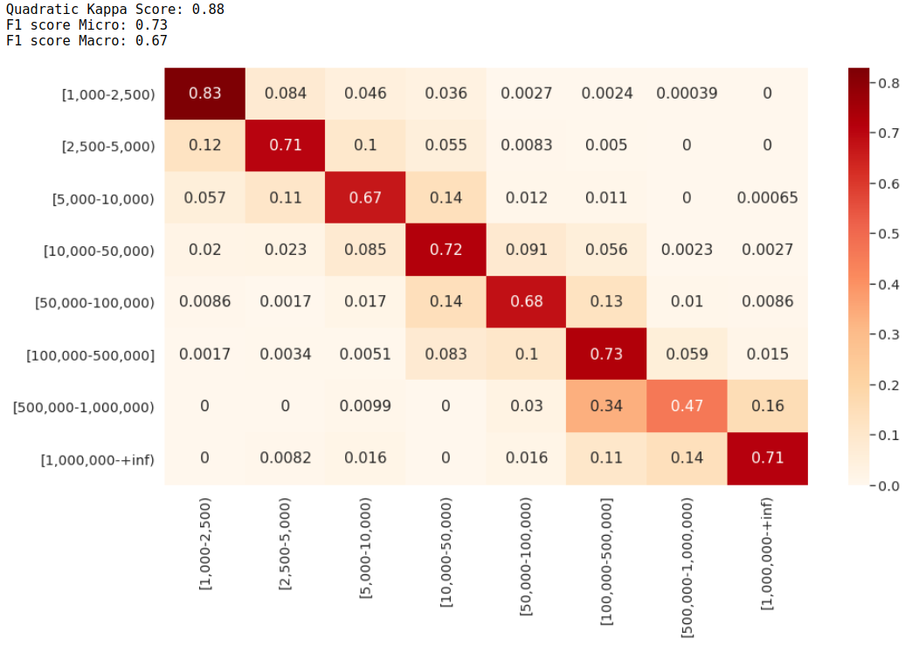

<h1>DBpedia's cities population prediction with just a short description</h1>

* The idea is to split the [dbpedia](https://wiki.dbpedia.org/) cities in 8 bins by population and predict where they belong using only short description's file.
* To get the short descriptions download <b>short-abstracts_lang=en.ttl</b> file [here](http://dbpedia-generic.tib.eu/release/text/short-abstracts/2020.02.01/).
* See [NLP_evaluation.ipynb](NLP_evaluation.ipynb) to see the results and a deeper explanation .
* Once an acceptable model is found, we can use its predictions as features to a regression model used [here.](../README.md) 

This is the distribution of the data, you can see the data is unbalanced

<b> Some examples of descriptions: </b>

* `"Ceguaca (Spanish pronunciation: [seˈɣwaka]) is a municipality in the Honduran department of Santa Bárbara. Their latitude is 14.80000 and their longitude is -88.20000."@en`
* `"Domburg is a seaside resort on the North Sea, on the northwest coast of Walcheren in the Dutch province of Zeeland. It is a part of the municipality of Veere, and lies about 11 km northwest of the city of Middelburg, the provincial capital."@en`
* `"Sükösd (Croatian: Čikuzda) is a village in Bács-Kiskun county, in the Southern Great Plain region of southern Hungary."@en`
* `"Tuba City (Navajo: Tó Naneesdizí) is an unincorporated town in Coconino County, Arizona, on Navajo lands, in the United States. It is the second-largest community in Coconino County. The population of the census-designated place (CDP) was 8,611 at the 2010 census. It is the Navajo Nation's largest community, slightly larger than Shiprock, New Mexico, and the headquarters of the Western Navajo Agency. The Hopi village of Moenkopi lies directly to its southeast."@en`
*  `"The city of Adel is the county seat of Cook County, Georgia, United States, located fifty-two miles (84 km) southeast of Albany. As of the 2010 census, the city had a population of 5,344."@en`

Half the short descriptions contains the actual population in it, However I won't be using any feature extraction technique.

There are a lot of improvements to be done here, but a simple approach was enough to reach a Quadratic Kappa Score of <b>0.88</b> and a F1 score micro average of <b>0.73</b>
Although this is not great it will prove to be of help later with [the regression model](../evaluation.ipynb#LGBM-+-NPL-(from-notebook-nlp_evaluation))

### The approach:
* Splits the data in 8 bins in a sensible way (the smaller the group of cities, the narrower the bin)
* Uses a Count vectorizer and a TfidfTransformer to normalize the counts
* Uses custom Analyser: 
    * removes stopwords
    * Applies lowercase
    * Removes punctuation
    * Generates 1 and 2 ngrams 
    * Stems words with SnowballStemmer
    * Adds custom token for possible dates (any number between 1400 and 2019)
    * Adds custom tokens for numbers (less than 2500, less than 5000, less than 10000 and so on)
* Upsamples data to balance the dataset
* Train Logistic regression and SGDClassifier (huber loss) and stacks them.
* Go to helper_functions.py for more information

* **Problems and limitations:**
  - We are losing information when transforming a regression problem to a classification one. The models don't care about the distance of the error (ie: if the real bin is the n° 1, it's not the same to predict bin n° 2 than to predict bin n° 7)

* **Further improvements**:
  - 50% of the description has the population written, so we could try some feature extraction technique
  - Currently all punctuation is being removed at once, but we could make our parser clever
  - As mentioned earlier, we should try a regression model because the order is important here.
  - Another way would be having a Quadratic weighted Kappa as loss or validation 
  - Show feature importance (words that have more weight in each bin)